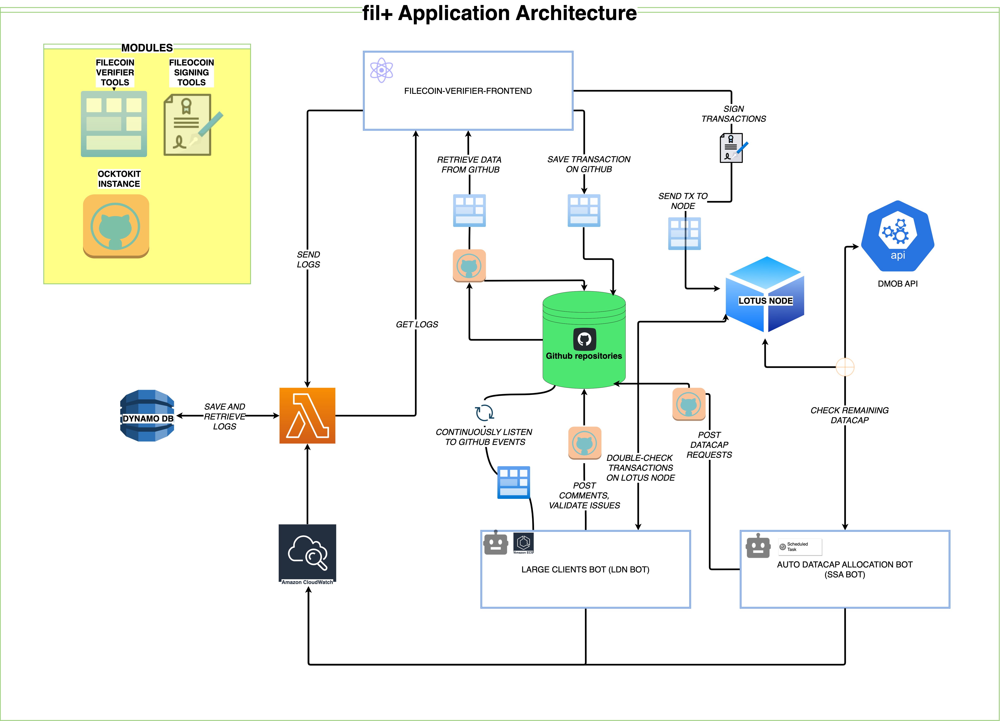

# Architecture
## Description
This is a general overview of fil+ appliction.

Each component has its repository linked, more info can be found there.

## Diagram

## Components
### Filecoin Verifier Frontend
- React application
- nodejs 14 (to be updated soon)
- React 18
- uses fvt, fst, and oi
- [repository](https://github.com/keyko-io/filecoin-verifier-frontend)

*Description*
This is the fil+ ui. it is needed to sign datcap requests.

### Large Clients Bot (LDN bot)
- Probot Application
- nodejs 16 
- uses fvt, fst, and oi
- Deployed as an Amazon ECS service
- Run as a loop
- [repository](https://github.com/keyko-io/filecoin-large-clients-onboarding-bot)

*Description*
This bot continuosly listen to filecoin-project github repos, then post comments according to the events. it also validate issues when created/modified.
It connect to the lotus node to validate the transaction signed on the user interface.

### Auto Datacap Allocation Bot (SSA bot)
- Probot application
- nodejs 16 (to be updated soon)
- uses fvt, fst, and oi
- Deployed as an Amazon ECS service
- Run as a scheduled task
- [repository](https://github.com/keyko-io/filecoin-auto-datacap-allocation-bot)

*Description*
This bot run every 3 hours, call the lotus node and the Dmob api to check the remaining datacap. If the conditions are met, it posts new datacap requests on the github repos

### Lotus Node
- Filecoin Node necessary to sign and register transaction in filecoin network
- Written in go
- Maintained by Filecoin team
- fil+ application accesses it using fvt to parse the node content
- front end use fst to sign transactions and send them to the node

### Dmob API
- Maintained by Dmob team
- It serves as datasource for fil+, used when the lotus node is down

### Github Repositories
- filecoin-project repositories used to store public information about datacap requests

### AWS Lambda
- Used to save and retrieve logs for fil+ application
- [repository](https://github.com/keyko-io/filecoin-logs-lambda)

### Modules
#### Filecoin Verifier Tools (fvt)
- [repository](https://github.com/keyko-io/filecoin-verifier-tools)

#### Filecoin Signing Tools (fst)
- [repository](https://github.com/Zondax/filecoin-signing-tools)

#### Ocktokit Instance (oi)
- [repository](https://github.com/octokit)

